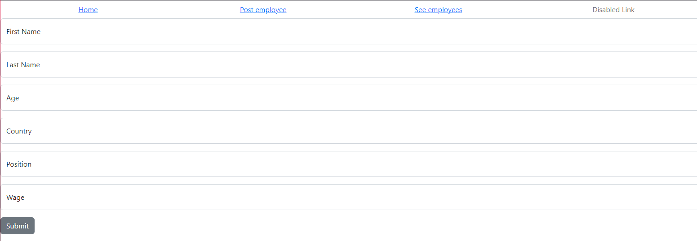
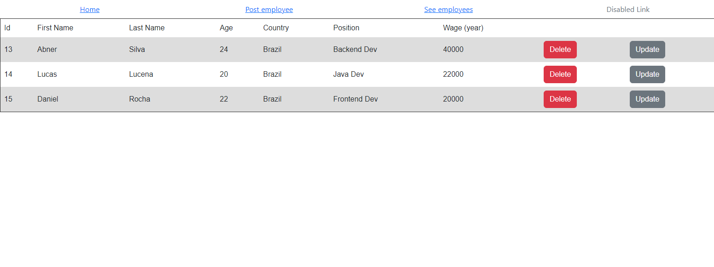

# Simple React-Spring CRUD

This repository is directed to a full stack personal project, where I'll develop the Frontend with React and consume the Backend API developed with Spring Boot.
 In addiction to do a few more things with this project, I'll do a Python automation script that will populate the Employees data with Selenium.

## Backend
The backend was developed with Spring Boot and Java 17, so after configuring the Java, open the "server" folder and start the Spring API.
 You will have access to the API at `http://localhost:8080/`. Authentication isn't needed.

## Frontend
To run the frontend, you will need to run a React project located at the "client" folder su just run `npm install` and `npm start` at the client folder directory.

After running the command lines below, you can have access of this following pages at `http://localhost:3000/`:

### Post Page
There you can create a new employee.

### Get Page
There you can see all the employees, delete some employee and also update them.
